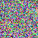
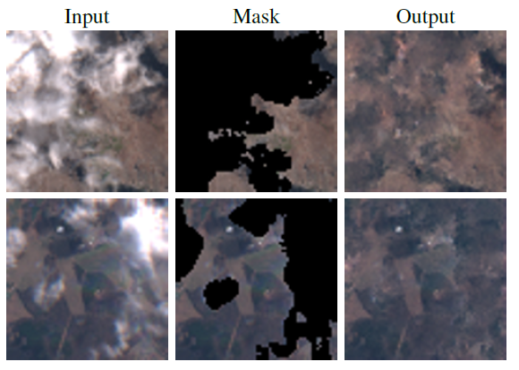
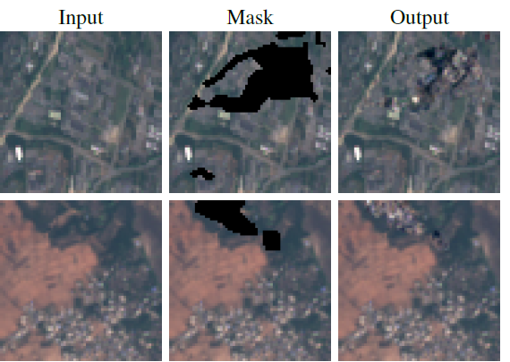
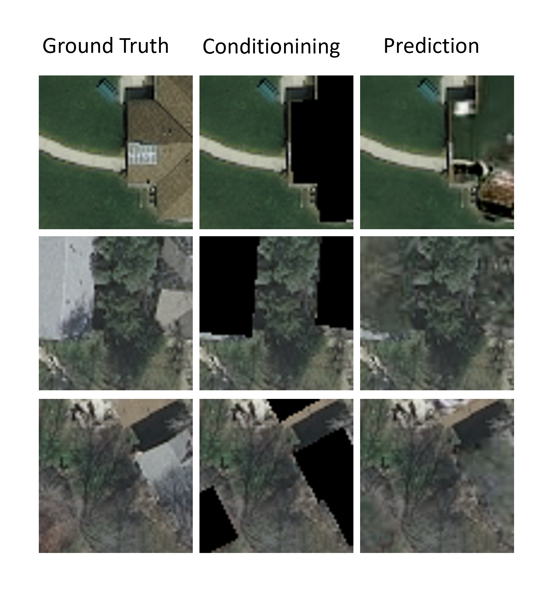

# EO-Diffusion
Here you find the code for our [paper](assets/2023_BIDS_Diffusion_Models_for_EO.pdf) "Diffusion Models for Earth Observation Use-cases: from cloud removal to urban change detection", accepted as oral at Big Data From Space 2023 (BIDS 2023)
<p align="center">
  
</p>

## Demo
download the following [checkpoint](https://drive.google.com/file/d/1u415nF2ZzsNnJ8w-BdzT8FC8123R4LcJ/view?usp=sharing) in "results" folder and rename it "clouds_best.pt". </br>
You can find a demo at the following notebook [EO_Diffusion.ipynb](EO_Diffusion.ipynb)
## Use-Cases
### Cloud Removal
<p align="center">
  
</p>

### Synthetic OSCD
<p align="center">
  
</p>

### Urban Replanning
<p align="center">
  
</p>

## Installation
Conda environment: 
- Conda 23.1.0
- CUDA toolkit: 11.7.1
- Pytorch: 11.3.0
- Torchvision + torchaudio: 0.14.0 + 0.13.0
- Tested on an NVIDIA RTX 4000 (49 GB)

GPU utilities installation:
I don't recomment using the exported eo_diffusion.yml file. It's better to install it directly from pytorch website with the required versions, as shown in the command below:

```bash
conda install pytorch torchvision torchaudio pytorch-cuda=11.7 -c pytorch -c nvidia
conda create -n env_name
conda activate env_name
conda install pip
pip install -r requirements.txt
```

## References

Lilian Weng blog on Diffusion Models: https://lilianweng.github.io/posts/2021-07-11-diffusion-models/

The Denoising Diffusion Probabilistic Models paper: https://arxiv.org/pdf/2006.11239.pdf 

RePaint paper: https://arxiv.org/abs/2201.09865

## Acknowledgments
<p align="center">
  
</p>

This work is the result of a collaboration between [ESA](https://www.esa.int/), [Φ-Lab](https://philab.esa.int/about/) and [Sapienza University of Rome](https://www.uniroma1.it/it/), [Alcor Lab](https://alcorlab.diag.uniroma1.it/) for my master thesis ([manuscript pdf](assets/Fulvio_Master_Thesis_Definitive.pdf)).

